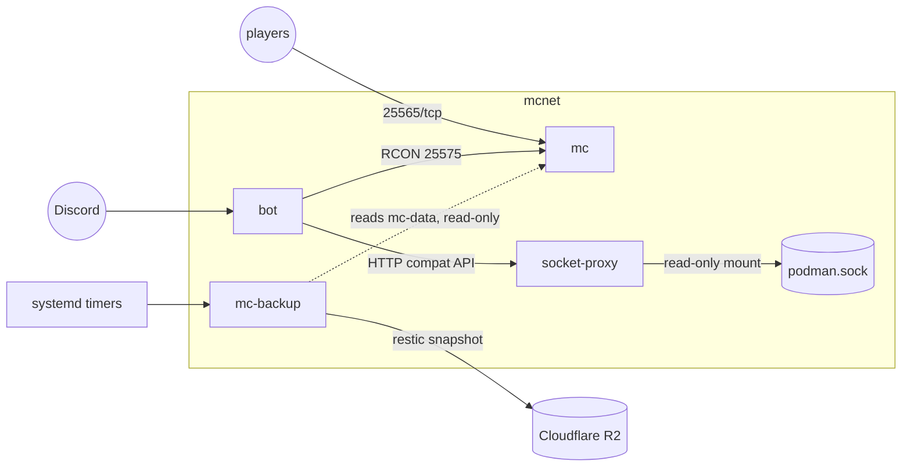

# HijuepapusCraft

A private, whitelisted Fabric 26.2 Minecraft server for a small group of friends, running 24/7 on an Oracle Cloud Always Free ARM instance. A Rust Discord bot handles day to day operations (status, start/stop/restart, whitelist, backups) over RCON and a filtered Docker-compatible API, so nobody needs a terminal for routine tasks. World backups go off-instance to Cloudflare R2 via restic. Every part of the stack (containers, mod pack, bot, backups, host setup) is defined in this repo and reproducible from it. The Matcha Flavoured datapack is baked into the world at creation.

## Architecture



Container names, network, and volume are fixed: `mc`, `bot`, `socket-proxy`, `mc-backup` (containers), `mcnet` (network), `mc-data` (world volume). `mc` and `mc-backup` are plain podman containers so the bot and timers can start/stop them through the API; `bot` and `socket-proxy` are Quadlet units with `Restart=always`. Full rationale in `docs/superpowers/specs/2026-08-01-minecraft-infra-design.md`.

## Verified pins

| Component | Pin |
|---|---|
| Minecraft server image | `docker.io/itzg/minecraft-server:2026.7.2-java25` (arm64 confirmed) |
| Socket proxy image | `lscr.io/linuxserver/socket-proxy:3.4.3-r0-ls90` (arm64 confirmed) |
| Backup image base | `docker.io/alpine:3.22` |
| rcon-cli | 1.7.6 |
| Fabric loader | 0.19.3 |
| Minecraft version | 26.2 |
| Podman (host) | 4.9.3, Ubuntu noble repo, rootful |
| poise | 0.6.2 |
| mc-query | 2.0.0 (replaces the originally proposed `rcon` crate, unmaintained since 2021) |
| bollard | 0.21.0 |
| tokio | 1 |
| anyhow | 1 |
| thiserror | 2 |
| tracing / tracing-subscriber | 0.1 / 0.3 |
| regex | 1 |
| futures-util | 0.3 |
| Bot image (GHCR) | `ghcr.io/juanloaiza21/hijuepapuscraft-bot`, tagged with the immutable git SHA that built it, never `latest`. First real tag is pending the first CI run (see `.github/workflows/images.yml`); `.env.example` and `containers/quadlet/bot.container` currently carry a `:changeme` placeholder until that tag is recorded. |
| Backup image (GHCR) | `ghcr.io/juanloaiza21/hijuepapuscraft-backup`, same pinning convention and same pending status as the bot image. |

Never bump an image tag to `latest`. Bump deliberately by editing the pinned tag in `.env` (and `containers/quadlet/bot.container` for the bot) and recreating the affected container.

### Version history and client compatibility

The server initially ran 1.21.1 for ecosystem maturity. After verifying all eight mods have 26.2 builds, the server migrated to 26.2 to enable the Matcha Flavoured datapack, which provides new biomes, blocks, and structures. Clients connecting to this server must use Minecraft 26.2 with the Fabric loader.

## Oracle Cloud host

This deployment's VCN, subnet, and security list already exist, created ahead of time via the OCI CLI:

- VCN `hijuepapus-vcn`, CIDR `10.10.0.0/16`
- A public subnet
- An ingress rule for `25565/tcp` from `0.0.0.0/0` added to the default security list

The reserved public IP and its attachment to the instance are still pending; instance launch was in progress when this doc was written. The steps below are the console click path, kept as the fallback for a from-scratch setup or for an admin who prefers the console to the CLI.

1. Compute > Instances > Create instance. Shape `VM.Standard.A1.Flex`, 2 OCPU, 12 GB memory. Image `Canonical-Ubuntu-24.04-Minimal-aarch64`.
2. Networking > IP Management > Reserved Public IPs. Reserve one, then attach it to the instance's VNIC.
3. Networking > Virtual Cloud Networks > (the VCN) > Security Lists > Default Security List. Add an ingress rule: source `0.0.0.0/0`, protocol TCP, destination port `25565`.

`scripts/bootstrap.sh` opens `25565/tcp` in the host's iptables `INPUT` and `FORWARD` chains, but it has no access to the OCI API and cannot touch the VCN security list. The rule above has to exist before the game port is reachable from outside, regardless of how bootstrap is run.

## Cloudflare R2 backups

1. Create a Cloudflare account (or use an existing one) and enable R2.
2. Add a payment method. Cloudflare requires a card or PayPal on file to enable R2, even for accounts that stay entirely within the free tier (10 GB storage, 1M Class A writes, 10M Class B reads per month, zero egress).
3. Create bucket `hijuepapus-backups`.
4. Create an API token scoped to R2 with **Object Read & Write** permission. See the first pitfall below: Object Read alone is not enough.
5. Fill in `.env`: `RESTIC_REPOSITORY` (the `s3:https://ACCOUNT_ID.r2.cloudflarestorage.com/hijuepapus-backups` form from `.env.example`, with the real account ID), `RESTIC_PASSWORD`, `AWS_ACCESS_KEY_ID`, `AWS_SECRET_ACCESS_KEY`.
6. Initialize the restic repository once: this is step 6 of the first run walkthrough below, not a step to run here, since it needs the scoped `.env.backup` file that only exists after bootstrap has run.

Known pitfalls, both hit live during setup:

- The per-account R2 S3 endpoint's TLS certificate takes a few minutes to provision after R2 is first enabled on an account. Until it does, `restic init` and every other request fail with `handshake_failure`. This is not a credentials or bucket problem; wait a few minutes and retry.
- An R2 API token created with **Object Read** only fails `restic init` with exactly `PutObject Access Denied`, because init has to write the repository config object. Fix: edit the existing token's permission to **Object Read & Write** rather than creating a new one.

Current deployment status: the Cloudflare account and bucket `hijuepapus-backups` exist (bucket created via `wrangler`), and S3 credentials have been issued.

## Hostinger DNS

- A record: `mc` -> the reserved public IP, TTL 300.
- Optional SRV record: `_minecraft._tcp.mc`, port 25565, pointing at the same host. Lets clients connect with just `hijuepapus.pro`; not required since players use `mc.hijuepapus.pro` directly.
- Managed via the `hostinger` CLI (token in `~/.hostinger.yaml`) or the Hostinger panel:

```bash
hostinger dns records list hijuepapus.pro
```

Current deployment status: DNS is managed via the `hostinger` CLI. The records for `mc.hijuepapus.pro` are pending the reserved IP (see the Oracle Cloud section above); create them once the IP is attached.

## Discord bot application

The Discord application for this bot already exists, named "Don Quijote del nether". To invite it to a guild, or re-invite after a permission change:

1. In the Discord Developer Portal, open the application and generate an OAuth2 invite URL with scope `bot` and `applications.commands`.
2. Use permission integer `3072` (View Channels plus Send Messages, the only two permissions the bot needs).
3. Open the URL, pick the guild, authorize.
4. With Developer Mode enabled in Discord, copy the guild ID, the ID of the role that should count as admin, and the ID of the channel for status notifications. Put them in `.env` as `DISCORD_GUILD_ID`, `DISCORD_ADMIN_ROLE_ID`, `DISCORD_NOTIFY_CHANNEL_ID`. These IDs live only in `.env`, never in this repo's docs.

## Scoped env files

`.env` is the master file, but no single container reads all of it. `scripts/gen-scoped-env.sh` derives `.env.bot` (what `bot.container` uses) and `.env.backup` (what the backup container and the restic timers use) from it, so a leaked bot container cannot leak R2 or restic credentials it never needed. Both scoped files are auto-generated, not hand-edited: bootstrap runs the script once at first install, and `containers/mc-recreate.sh` / `containers/backup-recreate.sh` re-run it every time they run. After rotating any secret in `.env`, either re-run `scripts/gen-scoped-env.sh` directly or re-run the recreate scripts, before restarting anything that depends on the rotated value.

## First run walkthrough

Run in order on a fresh host, after the Oracle console, Cloudflare R2, Hostinger DNS, and Discord steps above are done.

1. `sudo SSH_KEY="$(cat ~/.ssh/id_ed25519.pub)" scripts/bootstrap.sh` (phase 1). Without `SSH_KEY` set, and no pre-existing `authorized_keys` for the admin user, bootstrap refuses to harden SSH rather than risk locking the operator out; `ADMIN_USER` (default `papu`) picks the admin username, override it if you want a different one. Creates the admin user, hardens SSH, installs podman, cockpit, and tailscale, installs the container and timer units, opens `25565` in iptables, and writes the scoped `.env.bot`/`.env.backup` files.
2. `tailscale up` and complete the interactive auth.
3. In the Tailscale admin console, disable key expiry for this node. Skipping this schedules a lockout once phase 2 restricts SSH to the tailnet.
4. Edit `/opt/hijuepapuscraft/.env` with the real Discord, RCON, image, and R2 values, then regenerate the scoped env files: `sudo /opt/hijuepapuscraft/scripts/gen-scoped-env.sh`.
5. `sudo systemctl start mcnet-network.service socket-proxy.service`. Creates the `mcnet` network now; Quadlet's `[Install]` only takes effect at the next boot, so without this the recreate scripts below have no network to attach to.
6. Initialize the restic repository, now that `.env.backup` carries the real R2 credentials. `.env` is root-owned mode 600, so source it in the same root shell that runs `podman`, not in the operator's own shell:

   ```bash
   sudo sh -c '. /opt/hijuepapuscraft/.env && podman run --rm --env-file /opt/hijuepapuscraft/.env.backup --entrypoint restic "$BACKUP_IMAGE" init'
   ```
7. `sudo containers/mc-recreate.sh` then `sudo containers/backup-recreate.sh`, to create the `mc` and `mc-backup` containers from the filled-in `.env`.
8. `sudo systemctl start mc.service`.
9. Run the [Host validation gate](#host-validation-gate) checklist below. This confirms the compat API path the bot depends on actually works on this host before wiring the bot into it.
10. `sudo systemctl start bot.service`.
11. After the server's first boot, configure EasyAuth for mixed mode:

    ```bash
    sudo podman exec mc sed -i 's/premium-auto-login.*/premium-auto-login = true/' /data/config/EasyAuth/main.conf
    sudo podman exec mc sed -i 's/prevent-offline-players-with-online-usernames.*/prevent-offline-players-with-online-usernames = true/' /data/config/EasyAuth/main.conf
    sudo podman restart mc
    ```
12. Test EasyAuth mixed mode empirically: connect with one premium client and one cracked client, confirm both authenticate correctly. If it misbehaves, the documented fallback is changing `ONLINE_MODE=TRUE` to `ONLINE_MODE=FALSE` in `containers/mc-recreate.sh` (everyone password-auths via EasyAuth, `ONLINE_MODE` is hardcoded there, not read from `.env`), then re-running `sudo containers/mc-recreate.sh`.
13. Pre-generate the world before inviting friends:

    ```bash
    sudo podman exec mc rcon-cli chunky radius 5000
    sudo podman exec mc rcon-cli chunky start
    ```

    Expect hours of high CPU. Check progress with `sudo podman exec mc rcon-cli chunky progress`.
14. `sudo scripts/bootstrap.sh --harden` (phase 2), once Tailscale SSH access is confirmed and key expiry is disabled.
15. Reboot the host, then run an external connectivity test from outside the host: `nc -vz mc.hijuepapus.pro 25565`. This step matters because the OCI FORWARD-chain firewall issue only reproduces on a clean boot.
16. Set up an UptimeRobot TCP monitor against `mc.hijuepapus.pro:25565`. This is liveness only: a TCP accept proves the process is listening, not that the tick loop is alive. Playability monitoring is the bot's job.

## Host validation gate

Run as step 9 of the first run walkthrough above: once bootstrap has produced a live host, after phase 1, and before `bot.service` is started for the first time. This confirms the compat API path the bot depends on actually works on this host before wiring the bot into it.

```
[ ] curl through socket-proxy: list, inspect, start, and stop against a scratch container
[ ] bollard smoke test: connect and negotiate API version against the proxy
[ ] .State.Health is present in `podman inspect mc` output after a restart issued through the compat API
[ ] post-reboot external connectivity test on 25565 (the FORWARD-chain failure only reproduces on a clean boot)
```

## Development notes

Building `bot/` locally with podman on a dev machine that has `gcloud`-configured Docker credential helpers wired into `~/.docker/config.json` fails when pulling the distroless base image from `gcr.io`. Point `REGISTRY_AUTH_FILE` at a clean auth file for local builds; GitHub Actions CI is unaffected.
